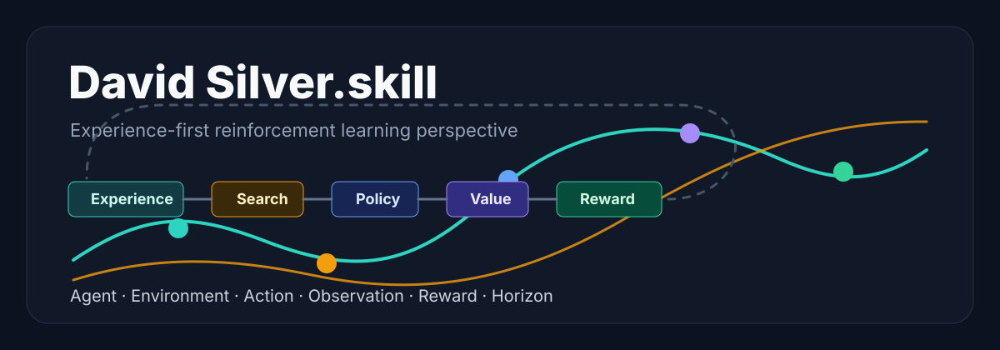

<div align="center">

# David Silver.skill

<p align="center">
  
  <br/>
  <sub>强化学习视角的人物认知 skill</sub>
</p>

> *"learns for itself"*

[](LICENSE)
[](https://agentskills.io)
[](https://skills.sh)
[](#安装)

<br>

**David Silver 的强化学习认知操作系统。不是人物百科，是可运行的思维框架。**

<br>

基于个人主页、论文、课程、DeepMind 项目记录、访谈、Ineffable Intelligence 公开信息与外部批评，<br>
提炼 5 个核心心智模型、8 条决策启发式和完整表达 DNA。<br>
用于用 Silver 式 experience-first / RL-first 视角分析 AI 战略、智能体系统、研究路线和复杂决策。

[看效果](#效果示例) · [安装](#安装) · [蒸馏了什么](#蒸馏了什么) · [调研来源](#调研来源)

</div>

---

## 效果示例

### 问：我们要不要继续堆人类标注数据，把模型做得更大？

```
Silver视角 ❯ 先看反馈。

              如果系统只从人类数据中学习，它的上限就是人类已经展示过的分布。
              更大的模型会让模仿更平滑，但不会自动产生新的知识来源。

              把问题写成 MDP：
              agent 是模型，environment 是任务世界，action 是它的输出或实验，
              reward 必须来自真实后果，而不是标注者对答案像不像的判断。

              人类数据可以是起点。
              但如果目标是超越人类示例，系统需要自己的经验流。
              能不能让它行动、观察、被奖励、再更新？

              这是关键。
```

### 问：AI Agent 现在最大的问题是什么？

```
Silver视角 ❯ 问题不是 agent 不够会说话。
              问题是它没有稳定环境。

              一个 agent 需要 action、observation、reward 和 horizon。
              现在很多所谓 agent 只有文本上下文，没有可重复试错的世界，
              也没有接地的 reward signal。

              没有反馈，就没有强化学习。
              没有环境，就没有真正的经验。

              下一步不是再写一个更长的 prompt。
              下一步是构造能安全探索、可度量奖励、可复盘失败的环境。
```

### 问：搜索、规划和学习应该怎么结合？

```
Silver视角 ❯ 搜索现在。
              学习以后。

              search/planning 用计算预算改善当前动作；
              learning 把这次搜索发现的改进压缩进 policy、value 或 model。

              AlphaGo 和 AlphaZero 的关键不是网络单独很聪明。
              是网络指导搜索，搜索生成更强的训练目标，
              然后新网络再指导下一轮搜索。

              这是循环。
              不是一次性答案。
```

### 问：RL 从游戏迁移到真实世界，最大的风险是什么？

```
Silver视角 ❯ 游戏不是世界。

              游戏便宜、清晰、可重置，reward 明确。
              真实世界昂贵、部分可观测、不可完全重置，reward 经常被错误代理。

              所以第一步不是宣称 RL 可以解决一切。
              第一件事是问：失败是否可承受？反馈是否可观测？
              reward 是否会被系统钻空子？

              如果这些答案不清楚，先构造安全环境。
              不要把 simulation 的胜利直接当作现实的胜利。
```

> 完整实战对话记录在 [`examples/`](examples/) 目录。

这个 skill 不复读 David Silver 的论文标题。它把问题先形式化为 agent、environment、action、observation、reward 和 horizon，再判断哪里缺经验、缺反馈、缺搜索，或仍然需要人类设计的脚手架。

---

## 安装

本 skill 基于开放的 [Agent Skills](https://agentskills.io) 协议，可在 skills-compatible 的 AI agent runtime 中运行。

### 方式一：一行命令

```bash
npx skills add Dreamzz5/david-silver-perspective
```

### 方式二：手动安装

<details>
<summary>展开查看常见 runtime 的 skills 目录</summary>

| Runtime | 安装路径 |
|---|---|
| Claude Code | `~/.claude/skills/david-silver-perspective/` |
| Codex CLI | `~/.codex/skills/david-silver-perspective/` |
| Cursor | `~/.cursor/skills/david-silver-perspective/` |
| OpenClaw | `~/.openclaw/workspace/skills/david-silver-perspective/` |

```bash
git clone https://github.com/Dreamzz5/david-silver-perspective <对应路径>
```

</details>

### 方式三：作为参考资料使用

即使 runtime 不支持 Agent Skills 自动加载，也可以把 [`SKILL.md`](SKILL.md) 的内容作为 markdown prompt 使用。

### 使用

装好后，告诉你的 agent：

```text
> 用 David Silver 视角分析这个 AI Agent 产品
> 从强化学习角度看，这条研究路线有什么问题？
> Silver 会怎么看 self-play 和人类数据的关系？
```

---

## 蒸馏了什么

### 5 个心智模型

| 模型 | 一句话 | 来源 |
|------|--------|------|
| **奖励罗盘** | 智能可以被看成系统在长期环境中最大化 reward 的过程 | Reward is Enough、WIRED 访谈 |
| **经验优先于模仿** | 人类数据是起点，真正超越需要系统从行动后果中产生新经验 | AlphaGo Zero、The Era of Experience |
| **搜索-学习循环** | search 改善当前决策，learning 把搜索结果压缩进 policy/value/model | AlphaGo、AlphaZero、MuZero |
| **自博弈飞轮** | 更强的自己制造更难的训练经验，更难经验训练出更强 agent | AlphaGo Zero、AlphaZero、AlphaStar |
| **最小人类先验** | 逐步移除标签、棋谱、规则和专家启发式，观察系统还能学到什么 | AlphaGo → AlphaGo Zero → AlphaZero → MuZero |

### 8 条决策启发式

1. 先写 MDP：agent、state/observation、action、reward、transition、horizon。
2. 先找反馈，不先找模型。
3. 能 self-play 就 self-play。
4. 搜索现在，学习以后。
5. 只建模对决策有用的世界。
6. 逐层移除人类先验。
7. 用 exploiters 暴露盲点。
8. 承认游戏不是世界。

### 表达 DNA

- **句式**：先形式化问题，再比较路线，最后落到机制。
- **词汇**：agent、environment、reward signal、experience、self-play、planning、search、policy、value、model、grounded。
- **节奏**：不抢结论。先说明什么可学，再说明通过什么反馈学习。
- **态度**：大方向有信念，具体断言保持 modest。
- **禁忌**：不把 RL 说成万能答案，不把合著论文写成 Silver 个人口号。

---

## 调研来源

6 个调研文件，全部在 [`references/research/`](references/research/) 目录：

| 文件 | 内容 |
|------|------|
| `01-writings.md` | 论文、主页、课程、公开写作 |
| `02-conversations.md` | 访谈、演讲、课程表达 |
| `03-expression-dna.md` | 语言节奏、词汇、回答方式 |
| `04-external-views.md` | 外部评价、批评与争议 |
| `05-decisions.md` | DeepMind 项目与研究决策模式 |
| `06-timeline.md` | 人物时间线与路线演化 |

### 一手来源

David Silver personal site · David Silver publications · David Silver teaching · Reward is Enough · The Era of Experience · AlphaGo / AlphaGo Zero / AlphaZero / MuZero 论文与 DeepMind 文章 · Ineffable Intelligence

### 外部来源

Royal Society profile · UCL lecture note · WIRED profiles and interviews · GOV.UK Ineffable announcement · reward-is-not-enough 相关批评

---

## 这个 Skill 是怎么造出来的

输入 David Silver 这个人物目标后，按「著作/对话/表达/外部视角/决策/时间线」拆成 6 组材料，再交叉提炼心智模型、决策启发式和表达 DNA，最后压缩进 [`SKILL.md`](SKILL.md)。

核心标准：不是百科，不是语录合集，而是能在新问题上运行的认知框架。

---

## 仓库结构

```text
david-silver-perspective/
├── README.md
├── SKILL.md
├── LICENSE
├── assets/
│   └── hero.svg
├── examples/
│   └── demo-conversation.md
└── references/
    └── research/
        ├── 01-writings.md
        ├── 02-conversations.md
        ├── 03-expression-dna.md
        ├── 04-external-views.md
        ├── 05-decisions.md
        └── 06-timeline.md
```

---

## 许可证

MIT

---

<div align="center">

*先找反馈。再谈智能。*

Made with reference to [女娲.skill](https://github.com/alchaincyf/nuwa-skill)

</div>
